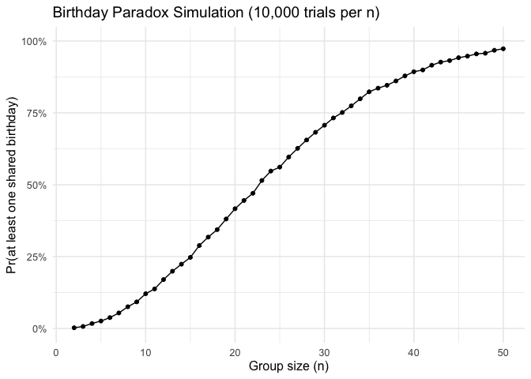

p8105_hw5_xw3106
================
Xinyu Wang(xw3106)

``` r
library(tidyverse)
```

    ## ── Attaching core tidyverse packages ──────────────────────── tidyverse 2.0.0 ──
    ## ✔ dplyr     1.1.4     ✔ readr     2.1.5
    ## ✔ forcats   1.0.0     ✔ stringr   1.5.1
    ## ✔ ggplot2   3.5.2     ✔ tibble    3.3.0
    ## ✔ lubridate 1.9.4     ✔ tidyr     1.3.1
    ## ✔ purrr     1.0.4     
    ## ── Conflicts ────────────────────────────────────────── tidyverse_conflicts() ──
    ## ✖ dplyr::filter() masks stats::filter()
    ## ✖ dplyr::lag()    masks stats::lag()
    ## ℹ Use the conflicted package (<http://conflicted.r-lib.org/>) to force all conflicts to become errors

``` r
library(broom)
```

# Problem 1

``` r
# Function: Generate n birthdays and check if duplicates exist
has_dup_birthday <- function(n, days = 365L) {
  bdays <- sample.int(days, size = n, replace = TRUE)
  
  any(duplicated(bdays))
}
```

``` r
set.seed(8105)

n_grid <- 2:50
B <- 10000

birthday_sim_results <- map_df(n_grid, function(n) {
  
  sims <- replicate(B, has_dup_birthday(n))
  
  tibble(
    n = n,
    prob_dup = mean(sims)
  )
})
```

``` r
# Visualization: Probability that at least two people share a birthday
ggplot(birthday_sim_results, aes(x = n, y = prob_dup)) +
  geom_line(color = "black") +
  geom_point(size = 1.4) +
  scale_y_continuous(labels = scales::percent_format(accuracy = 1), limits = c(0, 1)) +
  labs(
    title = "Birthday Paradox Simulation (10,000 trials per n)",
    x = "Group size (n)",
    y = "Pr(at least one shared birthday)"
  ) +
  theme_minimal(base_size = 12)
```

<!-- -->
