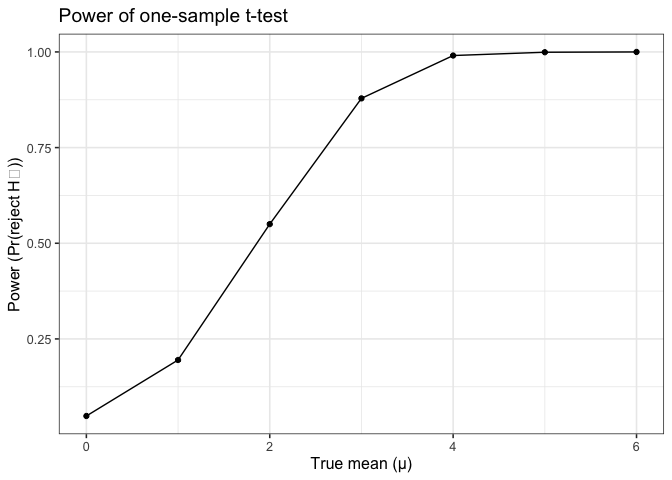
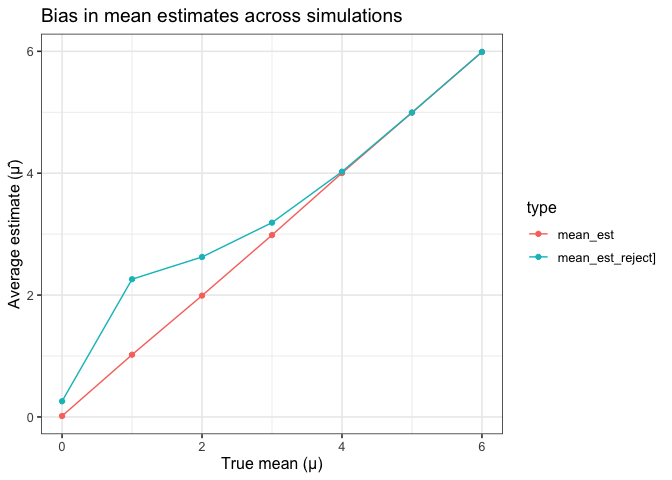
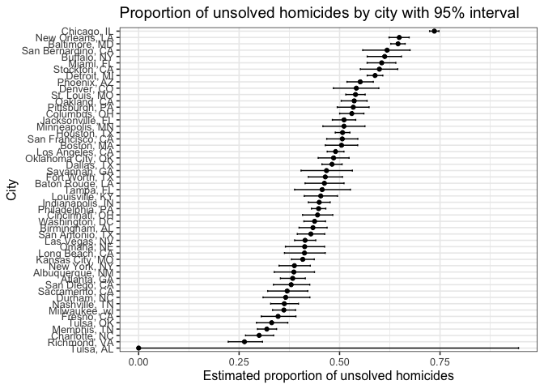

p8105_hw5_xw3106
================
Xinyu Wang(xw3106)

``` r
library(tidyverse)
```

    ## ── Attaching core tidyverse packages ──────────────────────── tidyverse 2.0.0 ──
    ## ✔ dplyr     1.1.4     ✔ readr     2.1.5
    ## ✔ forcats   1.0.0     ✔ stringr   1.5.1
    ## ✔ ggplot2   3.5.2     ✔ tibble    3.3.0
    ## ✔ lubridate 1.9.4     ✔ tidyr     1.3.1
    ## ✔ purrr     1.0.4     
    ## ── Conflicts ────────────────────────────────────────── tidyverse_conflicts() ──
    ## ✖ dplyr::filter() masks stats::filter()
    ## ✖ dplyr::lag()    masks stats::lag()
    ## ℹ Use the conflicted package (<http://conflicted.r-lib.org/>) to force all conflicts to become errors

``` r
library(broom)
```

# Problem 1

``` r
# Function: Generate n birthdays and check if duplicates exist
has_dup_birthday <- function(n, days = 365L) {
  bdays <- sample.int(days, size = n, replace = TRUE)
  
  any(duplicated(bdays))
}
```

``` r
set.seed(8105)

n_grid <- 2:50
B <- 10000

birthday_sim_results <- map_df(n_grid, function(n) {
  
  sims <- replicate(B, has_dup_birthday(n))
  
  tibble(
    n = n,
    prob_dup = mean(sims)
  )
})
```

``` r
# Visualization: Probability that at least two people share a birthday
ggplot(birthday_sim_results, aes(x = n, y = prob_dup)) +
  geom_line(color = "black") +
  geom_point(size = 1.4) +
  scale_y_continuous(labels = scales::percent_format(accuracy = 1), limits = c(0, 1)) +
  labs(
    title = "Birthday Paradox Simulation (10,000 trials per n)",
    x = "Group size (n)",
    y = "Pr(at least one shared birthday)"
  ) +
  theme_minimal(base_size = 12)
```

<!-- -->

As the group size grow, we can see an increase of the probability that
at least two people share a birthday.Around n = 23, this probability is
approximately 50%, consistent with the well-known “birthday paradox.” As
the number of people approaches 50, the probability becomes closer to 1.
This indicates that, despite having 365 possible birthdays, the
probability of sharing a common birthday increases rapidly as the group
size grows.

# Problem 2

``` r
# Function: simulate dataset, return estimate and p-value
sim_t_test = function(mu, n = 30, sigma = 5) {
  
  x = rnorm(n, mean = mu, sd = sigma)
  
  test = t.test(x, mu = 0)
  
  # extract mean estimate and p-value
  tibble(
    mu_hat  = mean(x),
    p_value = broom::tidy(test)$p.value,
    mu_true = mu
  )
}

## Run simulation for mu = 0:6 with 5000 duplicates
set.seed(8105)

sim_results =
  map_df(0:6, function(mu) {
    replicate(5000, sim_t_test(mu), simplify = FALSE) |> bind_rows()
  })
```

``` r
## Summarize simulation results
summary_df =
  sim_results |>
  group_by(mu_true) |>
  summarize(
    power= mean(p_value < 0.05),
    mean_est_all= mean(mu_hat),
    mean_est_rej= mean(mu_hat[p_value < 0.05])
  )

summary_df
```

    ## # A tibble: 7 × 4
    ##   mu_true  power mean_est_all mean_est_rej
    ##     <int>  <dbl>        <dbl>        <dbl>
    ## 1       0 0.0486       0.0157        0.258
    ## 2       1 0.195        1.02          2.26 
    ## 3       2 0.55         1.99          2.62 
    ## 4       3 0.879        2.98          3.19 
    ## 5       4 0.991        4.00          4.02 
    ## 6       5 0.999        4.99          5.00 
    ## 7       6 1            5.99          5.99

``` r
summary_df |>
  ggplot(aes(x = mu_true, y = power)) +
  geom_line() +
  geom_point() +
  labs(
    x = "True mean (μ)",
    y = "Power (Pr(reject H₀))",
    title = "Power of one-sample t-test"
  ) +
  theme_bw(base_size = 12)
```

<!-- -->

As the true mean μ increases, the statistical power also increases. When
μ = 0, the statistical power is approximately 0.05, which is consistent
with the expected result of the null hypothesis. As the true mean
increases, the frequency with which the test rejects the null hypothesis
H₀ also increases; when μ ≥ 5, the statistical power approaches 100%.
This pattern reflects the general relationship between effect size and
statistical power—with a fixed sample size, larger effects are more
easily detected.

``` r
summary_df |>
  pivot_longer(cols = c(mean_est_all, mean_est_rej),
               names_to = "type", values_to = "mean_est") |>
  mutate(type = recode(type,
                       mean_est_all = "mean_est",
                       mean_est_rej = "mean_est_reject]")) |>
  ggplot(aes(x = mu_true, y = mean_est, color = type)) +
  geom_line() +
  geom_point() +
  labs(
    x = "True mean (μ)",
    y = "Average estimate (μ̂)",
    title = "Bias in mean estimates across simulations"
  ) +
  theme_bw(base_size = 12)
```

<!-- -->

The population sample mean is very close to the true mean μ, we can tell
this is unbiased. However, when considering only the sample that rejects
the null hypothesis, the average estimator is consistently higher than
the true mean. This upward bias occurs because a significant result is
more likely to appear in the sample when the observed mean deviates
significantly from the null hypothesis. So this is a selection bias.

# Problem 3

``` r
# Load data
homicide_df =
  read_csv("data/homicide-data.csv")
```

    ## Rows: 52179 Columns: 12
    ## ── Column specification ────────────────────────────────────────────────────────
    ## Delimiter: ","
    ## chr (9): uid, victim_last, victim_first, victim_race, victim_age, victim_sex...
    ## dbl (3): reported_date, lat, lon
    ## 
    ## ℹ Use `spec()` to retrieve the full column specification for this data.
    ## ℹ Specify the column types or set `show_col_types = FALSE` to quiet this message.

``` r
homicide_df |> 
  glimpse()
```

    ## Rows: 52,179
    ## Columns: 12
    ## $ uid           <chr> "Alb-000001", "Alb-000002", "Alb-000003", "Alb-000004", …
    ## $ reported_date <dbl> 20100504, 20100216, 20100601, 20100101, 20100102, 201001…
    ## $ victim_last   <chr> "GARCIA", "MONTOYA", "SATTERFIELD", "MENDIOLA", "MULA", …
    ## $ victim_first  <chr> "JUAN", "CAMERON", "VIVIANA", "CARLOS", "VIVIAN", "GERAL…
    ## $ victim_race   <chr> "Hispanic", "Hispanic", "White", "Hispanic", "White", "W…
    ## $ victim_age    <chr> "78", "17", "15", "32", "72", "91", "52", "52", "56", "4…
    ## $ victim_sex    <chr> "Male", "Male", "Female", "Male", "Female", "Female", "M…
    ## $ city          <chr> "Albuquerque", "Albuquerque", "Albuquerque", "Albuquerqu…
    ## $ state         <chr> "NM", "NM", "NM", "NM", "NM", "NM", "NM", "NM", "NM", "N…
    ## $ lat           <dbl> 35.09579, 35.05681, 35.08609, 35.07849, 35.13036, 35.151…
    ## $ lon           <dbl> -106.5386, -106.7153, -106.6956, -106.5561, -106.5810, -…
    ## $ disposition   <chr> "Closed without arrest", "Closed by arrest", "Closed wit…

The dataset published by The Washington Post includes information on
52179 homicide cases reported across 50 major U.S. cities. Each row
represents a single homicide record, and the dataset contains 12
variables describing both the case and the victim.

Main variables include:

`uid`: a unique identifier for each homicide (e.g., “Alb-000001”).

`reported_date`: the date the case was reported.

`victim_first, victim_last`: the victim’s first and last names.

`victim_race, victim_age, victim_sex`: demographic information about the
victim.

`city and state`: the location where the homicide occurred.

`lat, lon`: latitude and longitude of the case.

`disposition`: the case status, showing whether it was closed by arrest,
closed without arrest, or remains open.

Overall, this dataset provides detailed, case-level information that can
be summarized by city to explore patterns in unsolved homicides and
differences in clearance rates across metropolitan areas.

``` r
# Create city_state and summarize
city_summary =
  homicide_df |>
  mutate(city_state = str_c(city, ", ", state)) |>
  group_by(city_state) |>
  summarize(
    total = n(),
    unsolved = sum(disposition %in% c("Closed without arrest", "Open/No arrest"))
  )
```

``` r
# test for Baltimore, MD
baltimore =
  city_summary |>
  filter(city_state == "Baltimore, MD")

baltimore_test =
  prop.test(baltimore$unsolved, baltimore$total)

baltimore_tidy =
  tidy(baltimore_test) |>
  select(estimate, conf.low, conf.high)

baltimore_tidy
```

    ## # A tibble: 1 × 3
    ##   estimate conf.low conf.high
    ##      <dbl>    <dbl>     <dbl>
    ## 1    0.646    0.628     0.663

``` r
# run prop test for all cities
city_results =
  city_summary |>
  mutate(
    test = map2(unsolved, total, ~prop.test(.x,.y)),
    tidy = map(test, tidy)
  ) |>
  unnest(tidy) |>
  select(city_state, estimate, conf.low, conf.high) |>
  arrange(desc(estimate))
```

    ## Warning: There was 1 warning in `mutate()`.
    ## ℹ In argument: `test = map2(unsolved, total, ~prop.test(.x, .y))`.
    ## Caused by warning in `prop.test()`:
    ## ! Chi-squared approximation may be incorrect

``` r
## Visualization
city_results |>
  mutate(city_state = fct_reorder(city_state, estimate)) |>
  ggplot(aes(x = estimate, y = city_state)) +
  geom_point() +
  geom_errorbar(aes(xmin = conf.low, xmax = conf.high), width = 0.3) +
  labs(
    x = "Estimated proportion of unsolved homicides",
    y = "City",
    title = "Proportion of unsolved homicides by city with 95% interval"
  ) +
  theme_bw(base_size = 12)
```

<!-- -->

The estimated proportions of unsolved homicides exhibit considerable
heterogeneity across the fifty metropolitan areas included in the
dataset. While the majority of cities report unsolved proportions
between approximately 0.4 and 0.6, several jurisdictions deviate
markedly from this range. In particular, Chicago, IL, New Orleans, LA,
and Baltimore, MD display the highest proportions of unsolved cases,
approaching or exceeding 70 percent. Conversely, Richmond, VA and Tulsa,
OK show substantially lower proportions, suggesting comparatively higher
clearance rates. The observed differences are unlikely to be explained
by random variation alone and may instead reflect structural disparities
in investigative capacity, resource allocation, or case reporting
practices among cities.
